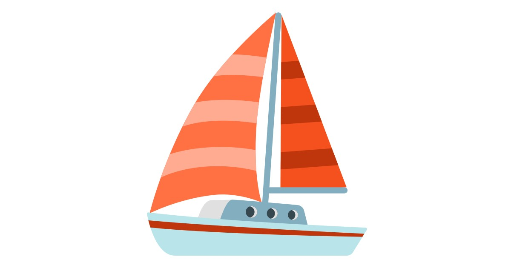

# Autonomous Sailboat

### **A project for automating a reduced model of Sailboat.**

Find all details here : https://zeck69.github.io/autopilot_boat/

\
*Project made in the context of the course CS-358 at EPFL, under the supervision of M. Koch and M. Stella.*
