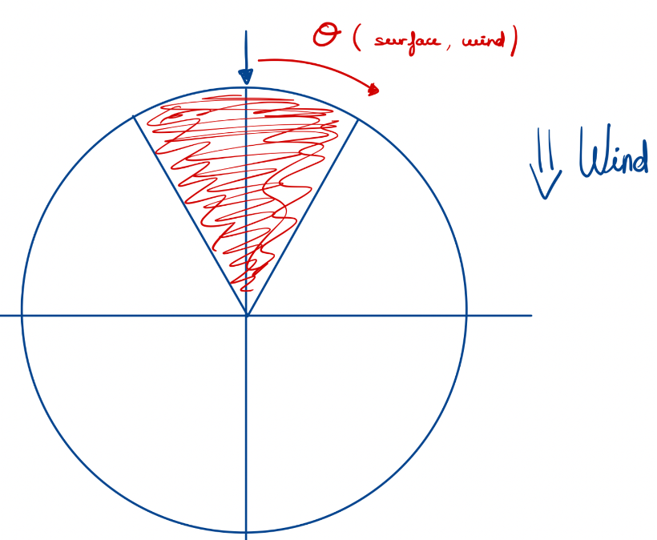

# Sailing principles


## Movement of the sail

<br/>

Degree of freedom for boat witha given wind             |  Degree of freedom of the sail
:-------------------------:|:-------------------------:
  |  


<div style="text-align: justify"> Before diving in the code, we have to understand how to move the boat with a given wind. First, the boat can only be directed in a direction at least 45° appart from the wind. The closest the boat gets to the wind cone (in red in the first) the closest our sail must be of the opposite diagonal (the red diagonal in the second image if the boat is at 45° to the right to the wind). </div>
<br/>
<em>For the following code we will talk about degrees between -179 (to the left) and 180 (to the right) for the position of the boat with respect to the wind that is our reference at 0 (cf. <b> method degrees_limit(int value) </b>)</em>. <br/><br/>

## Basic movement

<em>First thing, we have to positionate the sail automatically with a given wind to move forward</em>

* Predict an initial sail poition (cf. `degree_pred...(int boat_degree)`)
    * We first try to obtain geometrically the optimal position of the sail, computing the impact of the wind in the sail. This method was no where close to the desired objective and was very imprecise with the most extreme values (such as 0° or 180°).
    * Our second approach was to use pennants to experimentally see the impact of the wind in the sail and do a regression with the data to obtain a precise function. (%4.3 standard deviation)
    <br/>

      |  

```c++
/* return: degree to add from horizontal depending on current angle (horizontal being the degree 0 for the sail on right side, and 180 on the left side)
function obtained via regression of experimental values*/
int degree_prediction_before_horizon(int boat_degree){ 
    if(boat_degree < 0){
        return 180-(int)(-0.5162*(-(double)(boat_degree))+94.3846);
    }else{
        return (int)((-0.5162*(double)(boat_degree)+94.3846));
    }
}
```

* Optimize the position with actual input from sensors
    * Test mutiple angle postitions
    * Mesure the actual speed of the boat
    * The idea of this method is to determine the best sail position experimentally each time by positioning the sail at close positions to the prediction and mesure the linear speed of the boat thanks to our IMU.
    * (cf `test_speed()` for IMU testing and `degree_sampling(int)` for general method)

```c++
//input: start_degree = initial guess optimal position returned by degre_prediction
//puts the sail on different positions to find the best speed and sets the optimal position;
void degree_sampling(int start_degree){
    double speeds[2*SPAN];
    for (int i = -SPAN; i < SPAN; i++)
    {
        sail.write(start_degree+2*i);
        delay(1000);
        speeds[i+SPAN] = test_speed();
        delay(500);
    }
    sail.write(start_degree + best_position(speeds));
    speed = 0;
}
```
## Turning methods
<mark> Inside the code there is multiple methods with the same functionnality, some are named `show_IMU` because they were used to showcase the function without using a windvane and measuring turning with the gyroscope of the IMU. In these methods we rely on a variable `angle_boat` that is modified through the turnings to keep track of the position of the boat with respect to the wind.<br> Add to this, the implementation of these methods force to change the use of the clock of the arduino. Therefore our methods of `localisation` and `show_IMU` are not compatible at the moment.<br/>
In order to make this methods work together we should use another clock or update both whenever any of them are called.
 </mark>

 * The general method (cf `turning`) manages all maneuvers possibles, selecting the best fitting option for a given angle destination.
 * Input the final angle of the boat with respect to the wind and the program will chose which of the following methods to call.

  ### Turning on the same of the wind
 * if we don't want to change from side of the wind but get closer or further from the wind

 #### Basic description:

<div style="text-align: justify"> We compute the angle difference between our destination and our current position to decide the direction for the tiller. After this, we force the configuration to turn in the given direction and predict the position of the sail as smoothly as possible, as if ta human was leaving the sail free to adapt to the turn. (cf `turning_settings`)</div> <br>

 ### Jibing
 * if we want to change from side of the wind with the wind in our backs
 
 #### Basic description:

 ### Tacking
 * if we want to cross the wind cone during a maneuver
 <figure class="video_container">
  <iframe src=" https://www.youtube.com/watch?v=gMEOex9GQWU&t=55s" frameborder="0" allowfullscreen="false"> </iframe>
</figure>

 #### Basic description:
 ### Beating
 * if we want to go towards somewhere within the wind cone we will need to zizag our way upwards the wind with mutiple tacks

 #### Basic description:
 <br/><br/>

 # Auxiliary useful methods

 ## Smooth sail and tiller calibration
 In order to not make the boat sink via too fast changes of position, we develop some methods to move the servomotors more carefully.
<br><br/>
 <mark>This method was only implemented during the last part of the project and therefore has only been used for the navigation without windvane. Implementation in methods with windvane input is required (remplace every servo.write by this method).</mark>


 ## Degree calculations
 Making the degree span from -179° to 180° simplifies a lot calculations for turning
