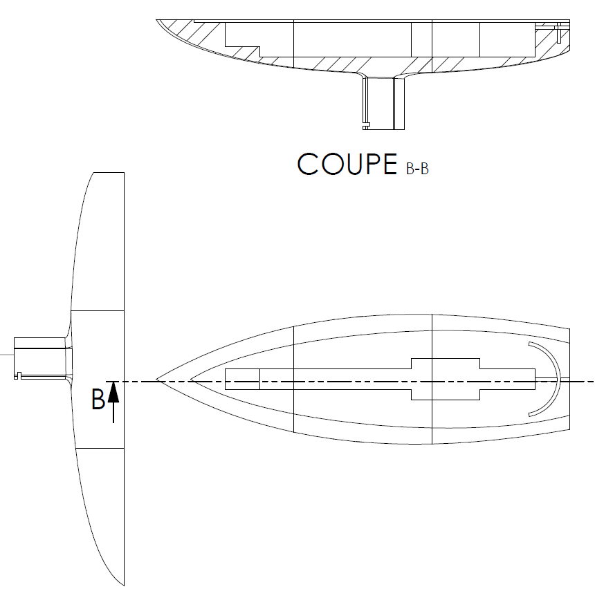

# Designing the Boat

## 1)   Naive design and guidelines for the boat

To build this boat, we needed to define clear guidelines that we had to follow to design our boat, as well as all the challenges we had to undertake. First of all, the major difficulties we had with this project come from the fact we will be using it in a marine/lake environnement. We thus had to think about :

1. &nbsp; [&nbsp;&nbsp;&nbsp;&nbsp; Flotation and Balance](#flotation-and-balance)
2. &nbsp;[&nbsp;&nbsp;&nbsp;&nbsp;Ability to Move Sail and Rudder ](#ability-to-move-the-sail-and-the-rudder)
3. &nbsp;[&nbsp;&nbsp;&nbsp;&nbsp;Space for Components](#space-for-components)
4. &nbsp;[&nbsp;&nbsp;&nbsp;&nbsp;Watertightness for our Components](#watertightness-for-our-components)
{: .fs-4 .fw-500}

### Flotation and Balance
The first step to make a boat is to do something that **floats**. As our project is roughly a small prototype on wich we tried to experiment automation, we based our calculation on simple principles like **Archimede's principle**. With the design given in the repository, we can have **2.5 kg of mass in total**, boat included. This is well enough, as the major source of weight in our boat is the boat itself. The rest of the components only weight 400g.

***

The **balance** of the boat is as much important as the previous consideration. There are three important parts of the boat that will influence its balance :
- The **spread of our components across the boat**
  - Our components aren't that heavy so the balance was not hard to find.
  - However, the biggest components - the battery - was placed as close as possible to the center of the boat.
  - &rArr; It does not cause much problem to have a boat leaning on its rear, as long as it is not close to sink. What should be seek is a lateral balance and avoiding to lean on the front.
- The ***dagger-board*** wich is mandatory, otherwise the boat would drift in the same direction as the wind instead of moving forward. It also helps stabilize the boat as its bearing capacity when moving creates a moment that keeps the boat upright.
- The ***keel*** might be the most precious ally for balance. Epecially when the mast is high and heavy, the keel plays the role of a counterweight creating a moment that prevent the boat from tilting on the side.

### Ability to move the sail and the rudder

The water forces us to carefully think about how to connect the servo to the rudder. Indeed, as you will see our first design had a direct connection between the servo and a underwater rudder, but it was raising major concerns. The servo is not waterproof so we need to keep it away from water as much as possible. A ballbearing was not sufficient and adding to that the pressure underwater, we were affraid water would find its way up to the servo. We finally took another approach explained [here](#2-first-design).

To move the sail is another challenge. There are many possibilities : either we use ropes like a sailor would do or we can directly connect a servo to set its position. We had the chance of having a strong servo wich made feasible the second one, taking away some difficulties.

### Space for components

Although not the toughest guideline, making space for components is crucial in the boat design. It was our starting point to determine the overall dimensions. There are plenty of possible arrangements for the components, different ways to design the boat to fit them in. But the simpler the better, as the components need to be manipulated at some point. We also have to take into account cable : space or holes to route the cables, placing components to avoid long cables...
\
\

 
### Watertightness for our components

The main problem with such automation project is the presence of **water**. This really complexify the way we have to think about our design. As previously mentioned, we need to be careful on the rudder axle, but also all the holes our boat has : for the sail, for the wind vane, ... But most of all, to protect our components, a cover over the compartments is mandatory, and should be tighly fixed to the hull.

Another approach could be to have some waterproof components, like the servos, wich was not our case.

### Naive design Based on these guidelines (or almost...)

Our first design had a more **complicated structure**. We tried to arrange components on top of each other, wich made the boat less long. But at the same time, it was increasing the difficulty to manipulate the components. The boat was however thicker and not very hydrodynamic. Here is the result :

 

  |  

Except floatability and balance of this design, the main issue we tried to address is the **watertightness**. We made different compartment to isolate all the components, in case one is flood. The cover is here to protect the inside of the boat. However, as previously mentionned, the fact that the rudder axle is directly connected to the servo in this design might have caused some troubles. Its complexity might also have been hard to manage and assemble, specially when testing.

## 2)	First design

After a **total refinement** of the design, we ended up having a laser solo like shape, with a simpler hull and space arrangement.

 

 

1. To solve the issue with the rudder, we made a tank-like turret system wich consists in a curved-shaped bulkhead combined with the tiller. In this manner, the hole at the back of the hull that allows the tiller to pass is always covered and water is stopped.

  |  

2. The shape of the hull, as well as the mast and the dagger-board are drop-shaped to be more hydrodynamic.

3. The keel in this design is clipped to the dagger-board thanks to a notch.

4. The mast is attached to the servo through a cross-shaped piece given with the servo, wich fits in a *puck* that is glued to the metallic bar inside the mast. We indeed added this safety precaution to prevent the mast from breaking if it was facing harsh weather conditions and high torque.

  |  

5. We have made a compartment for each component to separate them clearly.

## 3)	Design improvements

- We tried to improve the rudder by reducing the friction and improving the strength. But our attempts failed as the holes for it were really tight. Yet, we reprinted it with a greater infill value (% of plastic inside) to make it more robust.

- We had to make the cover thicker because of the *puck* we use for the mast. Indeed, the puck is too high to fit in a plate cover. It also enables us to better hold the mast.

## 4)	Printing the boat

We desided for convenience to entirely print our parts in PET-G with Prusa printers. To fit in the printer, we had to cut the hull in 4 parts and the mast in 8 parts wich are all available in the GitHub repository. 

Printing such a boat took some time. For a single part of the hull, the printing time is about 15 hours. We also had some problem with parts that were bent because of the heat of the bed of the printer.

## 5)	Assembling the boat

### Gluing parts together

To put parts together, we used epoxy glue for all the components.  

### The Sail

For the sail, we contact the SP 80 team to ask them if they can give us a piece of a sail. They redirect us to the SKIL. We get 3 different types of sails and we choose the lightest one because our objectif wasn’t the performance but just to make our boat move.
 

To construct our sail we needed : the sail, a wooden bar, a sewing machine, eyelets fastenings and our mast. First, we draw the form that we want, making sure that it’s big enough to have freedom of movement. We decided to make a triangular shape with rounded sides. Then we cut it and strengthen the side parallel to the mast by adding the wooden bar that we place at the sail and attach by sewing. Then we add a lining in the corner and eyelet fastenings to attach the sail to the mast with clamping clips.

## 6)	The keel issue
The keel was hard to make, as we needed it to be dense and heavy. We needed to iterate to find the perfect weight so that it counterbalance our mast. We finally ended up filling it with lead trapped in concrete.

In total, our keel has a weight of 600g, wich is sufficient for our prototype.

With our first, the density we needed to achieve was too high. Therefore, we had to add some extensions to the dagger-board to put it further from the mass center and increase its volume.

## 7)	Finalizing the boat

After some tests, we realized that the best way to make the boat watertight is to tape the cover with gaffer tape. We also faced a last minute issue : our aluminium bar in the mast was not glued, only clamped inside it. But during our tests, the bar came out : we thus used screws to fix this.

Our tests showed that the rudder is resistent enough to water force, and our boat assembly is strong and water resistant.

