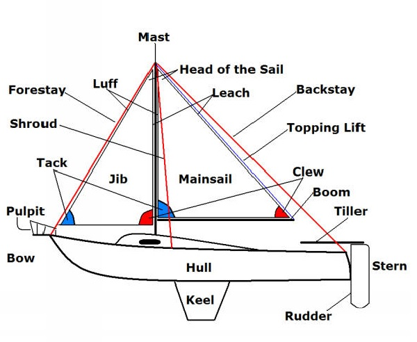

# Before Starting

Our project has two main phases, building the boat and automating it with components. It is thus the reason we will describe what is needed to make a 3D printed boat as well as how. But It is still possible to make your boat your way if you are more confortable with wood or another material. Another option is to buy one that fits the requirements of space and architecture for the components (easier than building a boat, but hard to find with such constraints). 

## :memo: List of Required Components 

- [ ] A Microcontroller : Arduino Uno or Mega
- [ ] Cables - of all sorts to connect components
- [ ] 2 Servo motors : one for the sail, the other for the rudder
- [ ] an IMU
- [ ] a Wind Vane (or equivalent, we will explain our solution later)
- [ ] a GPS
- [ ] a Sail
- [ ] a Battery of 1700 mAh
 
## :memo: List of Material You Might Need
- [ ] 3D Print Filament (PET-G recommended)
- [ ] Epoxy - to glue components together (don't underestimate gluing)
- [ ] Sanding Paper
- [ ] Lacquer Paint
- [ ] Silicon - for seal
- [ ] Soldering Material
- [ ] Heavy Bar of Metal - like lead
- [ ] Ciment (a small quantity)

:memo:

## Little Lexicon on Sailboat

