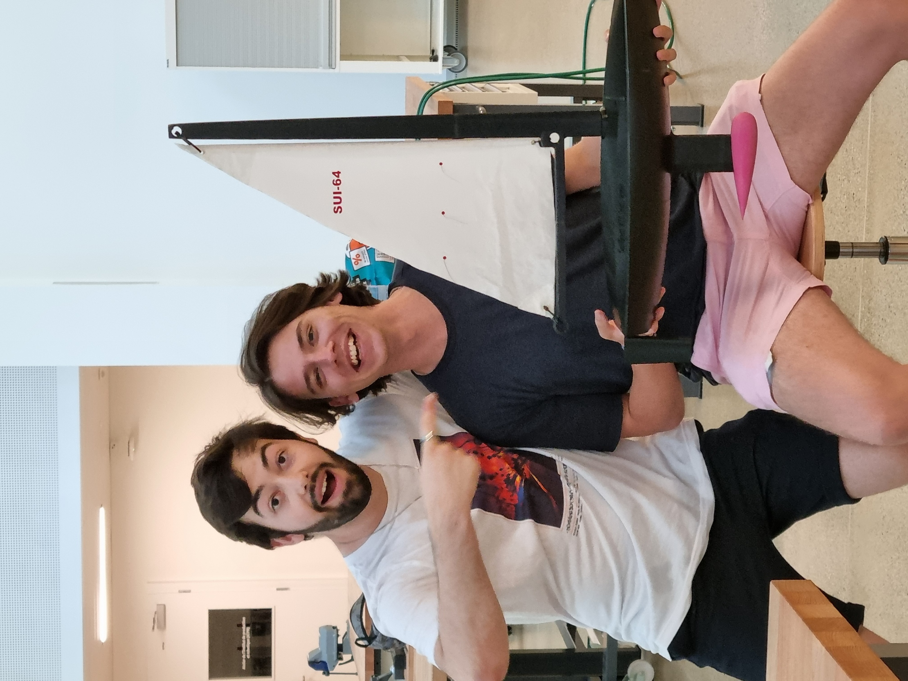

# **Autonomous Sailboat**

The project is born of our motivation to challenge ourselves. Not only did we try to make an electronic project, but we also implemented some mechanics, wich was not trivial for the IC students that we are. This website is here to show you our work, as well as guidelines to build this on your own and how to take over the project for improvements.

*For the code and design files, please refer to the Github repository :* 
[Github Repo](https://github.com/Zeck69/autopilot_boat){: .btn .flex-justify-around }