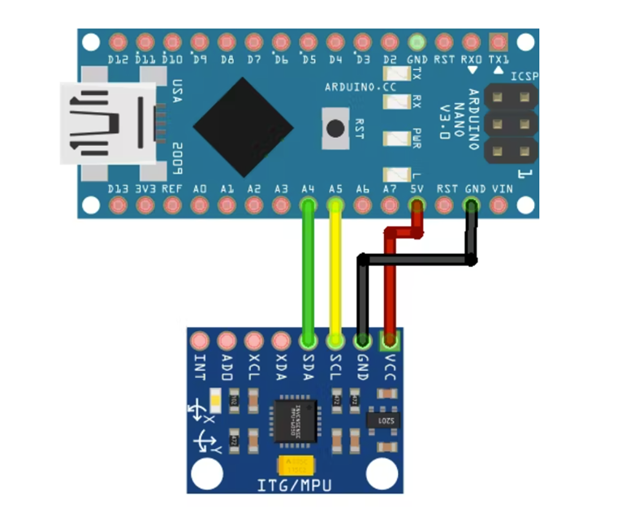
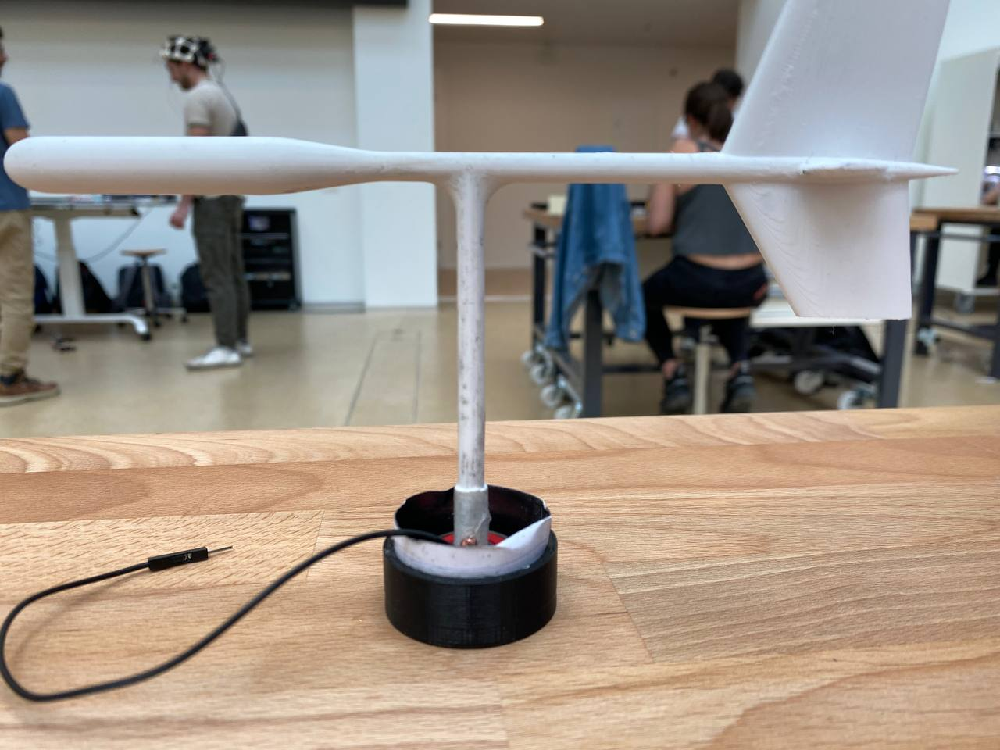

# Sensors

<div style="text-align: justify"> Sensors are essential to the design of our boat to analyse the wind direction, the speed of the boat and it's location. Here are the tools we used : 
</div>

## GPS 
  
<div style="text-align: justify"> A GPS allows us to measure time, location and speed. We wanted to use it to calculate the average speed of our boat to optimise the angle of our sail. Furthermore, we wanted to use the location to allow our boat to follow a trajectory independently. Unfortunately, we were not able to get our hands on a working GPS so could not implement these features with it. But we do recommend using one for the reasons above ! If you have the opportunity to get one, we recommend using the TinyGPS++ library from Arduiniana which is very easy to use and beginner friendly. 
<br/>
As an alternative solution, we have decided to use the IMU’s accelerometer and gyroscope to get the same, albeit less precise, information. 
</div>

## IMU
  
 <div style="text-align: justify"> First of all, what is an IMU and why do we need it ? An IMU is a module composed of an accelerometer and a gyroscope. Ours, also houses a temperature sensor but it can also have a magnetometer in some cases. To connect it to our Arduino, we can just use the analog pins A4, A5 for the SDA and SCL pins, the 5V pin for the VCC input and the ground pin as showed in the figure below. 
 </div>
  

  
<br>
 <div style="text-align: justify"> Be careful, not all IMUs can be directly powered from a 5V source, some need an additional level shifter from 5V to 3.3V. If you have an IMU 6050 GY-521 like us for example, you should be just fine with a 5V output. </div>
  
 <br>
  
 To code our IMU, we used the MPU6050 library created by jarzebski which allowed to create the functions detailed below : 
  
### test_speed() 
  
  This method integrates the data of the accelerometer along the X-axis to find the linear speed of our boat and uses the formula `speed = acceleration * time + speed` to update the speed each time it is called
  
  ```c++
// return: linear speed of the boat
double test_speed(){                 
    float acceleration = mpu.readNormalizeAccel().XAxis; // measuring acceleration three times
    delay(250);
    acceleration += mpu.readNormalizeAccel().XAxis;
    delay(250);
    acceleration += mpu.readNormalizeAccel().XAxis; 
    acceleration = (acceleration / 3.0) - acc_drift; // taking the average and substracting drift
    
    speed = (double)(acceleration * get_time()  + speed); // integration of the acceleration
    return speed;
}
```
  
  
### location_update()
  
  `location_update` is used to have a real time location of the boat named loc by integrating twice the acceleration according to the X-axis (as the unmodified data in in m/s^2) and integrating the angular speed from the gyroscope (rad/s) once according to the Z-axis. We hence have the radial and angular position of the boat. This data is then stored in a new structure we have named Location which has the radius, angle but also converts the position into cartesian coordinates x,y (with the origin at the initial location of the boat)
  
   ```c++
 typedef struct {   // struct representing a location (initialized at 0)
  double r = 0; // polar coordinates, r in meters
  double angle = 0; // in degrees
  double x = 0; // cartesian coordinates in meters
  double y = 0;
}Location ;
  
Location loc;   // current location of the boat
Location dest;  // next destination for the boat
Location dests[MAX_STOPS]; // array of all the destinations the boat will reach
int dest_index = 0;  // index of the current destination
int dest_total;  // total number of destinations
  
//updates location of boat
Location location_update() {
   float acceleration = mpu.readNormalizeAccel().XAxis;
   float gyroscope = mpu.readNormalizeGyro().ZAxis;
   delay(250);
   acceleration += mpu.readNormalizeAccel().XAxis;
   gyroscope += mpu.readNormalizeGyro().ZAxis;
   delay(250);
   acceleration += mpu.readNormalizeAccel().XAxis;
   gyroscope += mpu.readNormalizeGyro().ZAxis;
   
   acceleration = (acceleration / 3.0) - acc_drift;
   gyroscope = gyroscope / 3.0;
   
   double time = get_time();
   
   loc.r = (double) (acceleration * time * time  + speed * time + loc.r); // double integration of the X-axis acceleration
   loc.angle = (double) (gyroscope * time + loc.angle) ; // integration of the angular speed
   loc.x = loc.r * cos(loc.angle * DEG_TO_RAD);  // converts to cartesian coordinates
   loc.y = loc.r * sin(loc.angle * DEG_TO_RAD);
   speed = (double) (acceleration * time  + speed); // update of the speed to keep an accurate number
   
   return loc;
}
```
  
### update_arrival()

  The function `update_arrival()` checks whether we have arrived at the next target (stored in dest) and whether it is the final destination. If the boat has arrived at the destination then it will update it to the next one in the array and if the boat has arrived at the final destination, the code exits.
  
 ```c++  
void update_arrival() {
  if (arrival() && dest_index < (dest_total - 1)) {
    dest = dests[ ++dest_index ]; // if we have arrived to the current destination then the destination is updated to the next location in the array
  } else if ( dest_index == (dest_total - 1 )) {
    exit(0); // if we have arrived to our final stop then the code extis
  }
}
```
  
### arrival()

  `arrival()` calls `location_update()` and checks whether the boat has arrived to the next destination in the array of targets
  
 ```c++
  boolean arrival(){
  location_update();  
  if (abs(loc.r - dest.r) <= 5 && abs(loc.angle - dest.angle) <= 5) {
    return true; // if we are close enough to the target we return true
    }
  return false;
}
```
  
### get_time()
  
  `get_time` works with two global variables previous and present and allows to calculate the time passed (in seconds) since the last time it was called. It uses the `millis()` function of the arduino which returns time in milliseconds. 
  
 ```c++  
unsigned long previous;
unsigned long present;
  
//return: time from last mesure
double get_time() {
  previous = present; // updates time stamps
  present = millis();
  return (double) ((present - previous) * pow(10, -3));  // converts milliseconds to seconds
}
```

  
### create_target()
  
  `create_target` takes as input two coordinates x and y to translates them to an angle and radius to return a Location target for the boat. This function is useful in the setup to initialise our array of stops for the boat to go to
  
 ```c++
  Location create_target(double x, double y) {
  Location l;  // creates target
  l.x = x;
  l.y = y;
  l.r = sqrt(x*x + y*y) ;  // converts to polar coordinates
  l.angle = atan2(y , x) * RAD_TO_DEG;  
  return l;
}
```
### Issues with the IMU and our solution

The main issue we faced with the IMU was the acceloremeter's tendency to drift. The noise in the data meant that after integration, we had a 0.5m per second drift ! To remedy this problem we implemented two solutions : 

First of all we took three measurements of the acceleration and averaged the total to smooth out any noise and variation in the data.

And second we calculate a constant in the setup which represents the average acceleration when the IMU is at total rest which we then substract to the acceleration. 

These two steps have allowed us to limit the drift considerably and find correct measurements. Even with these solutions, unfortunately the drift still does affect our data after a while. 

The gyroscope did not have such an important drift and was only integrated once, so we did not see the need to implement the second solution. The first solution was nonetheless implemented to limit the impact of noise and anormal measurements. 


  
## Wind vane
One of the principal components of our boat is the wind vane. We will use it to find the direction of the wind to calculate the angle that we need to set in our servo to move our boat efficiently. First, as we wanted to focus on other tasks, the idea was to buy one ([link](https://www.lextronic.fr/girouette-compatible-arduino-microbit-grouve-60465.html)) . Due to some reasons, we couldn’t get it. Our solution was to use a potentiometer and put a piece on top. We tested two types :
- The first one (ref : SKU783982) had a lot of friction so the wind was not enough to move it. However, we tried to code it. We first tried without any library but we noticed that depending on the speed of rotation, the angle found was not the same. Then we tried a library (Encoder.h) but the accuracy of the angle deteriorated over time.
- The second one was really accurate but the principal problem was that it had a range from 0 to 180 and not 360


Finally, after a lot of tests we choose to make our potentiometer using a 3D printed piece, a bearing, a bristol paper, a pencil, a needle, 3 cables and a 3D printed wind vane. The idea was to construct a cylinder support where we put the paper colored with the pencil. Then we associate our 3D wind vane in the bottom with the bearing and the needle perpendicular to it. After we connect a cable to the needle and to the ends of the paper so we can use the resistance when the metal rod moves around.\
However, when the wind vane moved, the cables made it moves back so it was not really efficient. So, we choose to assume a constant wind and use the IMU to see the displacement and find the optimal position of the sail by optimization. 


